# Architecture — sconjoint

> Structural deep-learning estimation for forced-choice conjoint experiments.
> Acharya, Hainmueller, and Xu (2026).

---

## System Overview

`sconjoint` embeds a deep neural network in a random-utility logit model so that individual-level preference parameters vary flexibly with respondent-level moderators. The package provides double/debiased machine-learning inference via cross-fitting clustered at the respondent level, a full suite of structural quantities of interest, and (as of M5.a) forward-pass prediction on new moderator data through stored per-fold torch modules.

```mermaid
graph TD
    subgraph API["Public API Layer"]
        scfit["scfit()"]
        predict_sc["predict.sc_fit()"]
        quantities["sc_mrs · sc_wtp · sc_counterfactual · sc_importance · ..."]
        profile["sc_profile() · sc_profile_from_data()"]
        plot_h["plot helpers"]
    end

    subgraph Core["Core Estimation"]
        crossfit["crossfit.R — .sc_crossfit()"]
        training["training.R — .sc_train_fold() · .sc_predict_beta()"]
        dnn["dnn.R — nn_module definitions"]
        inference["inference.R — clustered SEs"]
        lambda["lambda-est.R — regularization"]
        rng["rng-parallel.R — L'Ecuyer streams"]
    end

    subgraph Data["Data Layer"]
        dataprep["data-prep.R — .sc_prep_data()"]
        datasets["data.R — sw2022 · gs2020 · bs2013"]
    end

    subgraph Quantities["Structural Quantities"]
        q_mrs["quantities-mrs.R"]
        q_wtp["quantities-wtp.R"]
        q_cf["quantities-counterfactual.R"]
        q_comp["quantities-compensating.R"]
        q_imp["quantities-importance.R"]
        q_het["quantities-heterogeneity.R"]
        q_frac["quantities-fraction.R"]
        q_pol["quantities-polarization.R"]
        q_di["quantities-direction-intensity.R"]
        q_opt["quantities-optimal-profile.R"]
        q_sub["quantities-subgroup.R"]
        q_clust["quantities-clusters.R"]
        q_class["quantity-class.R — sc_quantity S3"]
        q_help["quantity-helpers.R"]
    end

    subgraph S3["S3 Methods (scfit-class.R)"]
        print_sc["print · summary · coef · vcov"]
        predict_method["predict.sc_fit"]
    end

    scfit --> dataprep
    scfit --> crossfit
    crossfit --> training
    training --> dnn
    crossfit --> rng
    scfit --> inference
    scfit --> lambda
    predict_method --> training
    quantities --> q_class
    quantities --> q_help
    quantities --> profile
```

---

## Module Map

### Entry point — `R/scfit.R`

`scfit(formula, data, ...)` is the sole model-fitting entry point. Parses the formula, delegates to `.sc_prep_data()` for design-matrix construction, runs `.sc_crossfit()` for K-fold DNN training with L'Ecuyer-CMRG parallel RNG streams, computes clustered standard errors via `inference.R`, and assembles the `sc_fit` S3 object. As of M5.a, accepts `keep_modules` (default `TRUE`) to persist per-fold trained `nn_module` objects on the returned fit, enabling downstream `predict(newdata = ...)`.

### Cross-fitting — `R/crossfit.R`

`.sc_crossfit()` orchestrates K-fold cross-fitting. For each fold, calls `.sc_train_fold()` and `.sc_predict_beta()` from `training.R`. Returns `beta_hat` (N x p), `loss_traces`, `fold_id`, and `nets` (list of K trained `nn_module` objects).

### Training — `R/training.R`

`.sc_train_fold(net, Z_train, Y_train, ...)` trains a single fold's DNN via Adam with optional L2 regularization. `.sc_predict_beta(net, Z_new)` performs a forward-pass: sets the module to eval mode, constructs a torch tensor from `Z_new`, calls `net$get_beta(zt)` under `torch::no_grad()`, and returns a numeric matrix. This building block is reused by `predict.sc_fit()` for the M5.a forward-pass.

### DNN definitions — `R/dnn.R`

Defines the torch `nn_module` architecture(s). Each module exposes `$get_beta(z_tensor)` returning an N x p tensor of individual-level preference parameters.

### Data preparation — `R/data-prep.R`

`.sc_prep_data()` converts a formula + data.frame into the internal representation: `Y` (binary choice outcomes), `deltaX` (profile-difference design matrix), `Z` (respondent moderators), `cluster_id` (respondent identifiers), attribute metadata, and dummy-column name mappings.

### S3 class — `R/scfit-class.R`

Defines `print`, `summary`, `coef`, `vcov`, `confint`, `fitted`, and `predict` methods for the `sc_fit` class.

`predict.sc_fit(object, newdata = NULL, type = c("beta", "logit", "prob"))`:
- **`newdata = NULL`** (backward-compatible): returns stored cross-fit predictions. `type = "beta"` gives the N x p `beta_hat` matrix; `type = "logit"` and `"prob"` compute respondent-level choice indices from `deltaX * beta_hat`.
- **`newdata` supplied** (M5.a): forward-pass through stored per-fold networks. Accepts a data.frame (columns matching `z_names` are extracted) or a numeric matrix. Averages `.sc_predict_beta()` across K folds. Only `type = "beta"` is supported with newdata (logit/prob require task-level `deltaX` unavailable for new respondents). Requires `keep_modules = TRUE` at fit time; errors informatively otherwise.

### Inference — `R/inference.R`

Respondent-clustered standard errors and confidence intervals for `beta_hat`.

### Regularization — `R/lambda-est.R`

Data-driven selection of the L2 regularization parameter.

### Parallel RNG — `R/rng-parallel.R`

L'Ecuyer-CMRG stream generation for reproducible parallel cross-fitting across folds.

### Structural quantities — `R/quantities-*.R`

Twelve quantity modules, each computing a different structural quantity from the fitted `beta_hat` matrix:

| Module | Quantity |
|--------|----------|
| `quantities-mrs.R` | Marginal rate of substitution |
| `quantities-wtp.R` | Willingness to pay (signed MRS against cost) |
| `quantities-counterfactual.R` | Counterfactual choice probability |
| `quantities-compensating.R` | Compensating differential |
| `quantities-importance.R` | Attribute importance (variance decomposition) |
| `quantities-heterogeneity.R` | Per-dummy heterogeneity test |
| `quantities-fraction.R` | Fraction above/below threshold |
| `quantities-polarization.R` | Preference polarization index |
| `quantities-direction-intensity.R` | Direction-vs-intensity decomposition |
| `quantities-optimal-profile.R` | Greedy optimal profile |
| `quantities-subgroup.R` | Subgroup-conditional quantities |
| `quantities-clusters.R` | Preference clustering |

All quantity functions return `sc_quantity` objects (defined in `quantity-class.R`) with `print`, `summary`, `plot`, and `coef` methods. Helper utilities live in `quantity-helpers.R`.

### Profile helpers — `R/profile-helper.R`

`sc_profile()` and `sc_profile_from_data()` build and validate profile specifications for counterfactual and compensating-differential queries.

### Plot helpers — `R/plot-helpers.R`

ggplot2-based visualization for `sc_quantity` objects (ridge plots, coefficient plots, etc.). Uses `ggridges` for density visualizations.

### Package data — `R/data.R`

Three bundled synthetic datasets mirroring published conjoint studies: `sw2022` (Saha-Weeks), `gs2020` (Graham-Svolik), `bs2013` (Bechtel-Scheve).

---

## Dependencies

**Runtime**: torch (>= 0.13.0), stats, utils, parallel, future, future.apply, parallelly, withr, ggplot2, ggridges.

**Suggests**: testthat (edition 3), knitr, rmarkdown, covr, patchwork, quarto, scales, viridisLite.

---

## Test Suite

30 test files under `tests/testthat/` covering:
- DNN forward/backward correctness (`test-dnn.R`)
- Cross-fit determinism and parallel reproducibility (`test-crossfit-determinism.R`, `test-rng-streams.R`)
- Data preparation and validation (`test-data-prep.R`)
- S3 method contracts (`test-s3-methods.R`) — including M5.a predict(newdata) tests
- All twelve structural quantities (one test file per quantity)
- Case-study smoke tests against bundled datasets
- Lambda estimation, inference, plotting

222 assertions pass as of M5.a. R CMD check: 0 errors, 0 warnings, 0 notes.

---

## Tutorial

A 14-chapter Quarto book under `tutorial/` covering installation, quickstart, data preparation, model fitting, interpretation, all structural quantities, visualization, three case studies (Saha-Weeks, Graham-Svolik, Bechtel-Scheve), simulation diagnostics, advanced topics, and FAQ.

---

## Key Design Decisions (M5.a)

1. **Module persistence via `keep_modules`**: Per-fold `nn_module` objects are stored directly on the `sc_fit` list rather than serialized to disk. This keeps the API simple (`predict(fit, newdata = ...)` just works) at the cost of larger in-memory objects. Users who do not need forward-pass prediction can set `keep_modules = FALSE`.

2. **Forward-pass averaging**: `predict(newdata = ...)` averages `.sc_predict_beta()` across all K folds. This is the natural cross-fit analog — each fold's network saw different training data, and averaging reduces variance.

3. **Type restriction with newdata**: `type = "logit"` and `type = "prob"` are intentionally unavailable with `newdata` because new respondents lack task-level `deltaX`. The error message explains this clearly.
